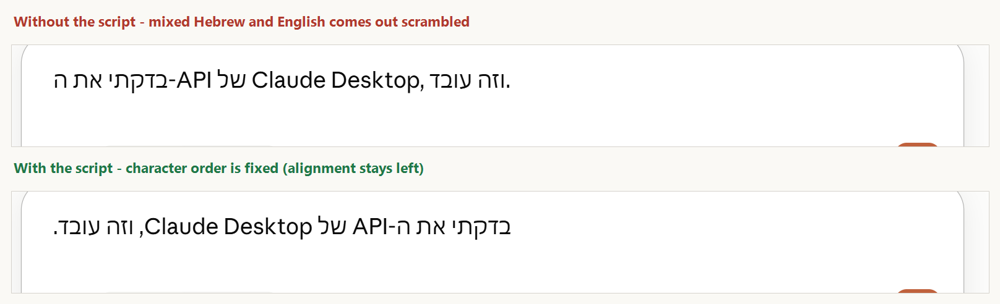

<div dir="rtl">

# Claude RTL Helper - עברית מימין לשמאל בתיבת ההקלדה של Claude Desktop

> פרויקט קהילתי עצמאי. אינו מסונף ל-Anthropic, אינו מקבל ממנה חסות ואינו נתמך על ידה. Claude ו-Anthropic הם סימני מסחר של Anthropic PBC ומוזכרים כאן לזיהוי המוצר שאיתו הכלי עובד בלבד.
>
> נבדק מול Claude Desktop בווינדוס 11, אוגוסט 2026. אנת'רופיק כבר הוסיפו רינדור RTL מובנה בלשונית Code, והקוד ללשונית Chat קיים באפליקציה אך מושבת - ייתכן שהכלי הזה יתייתר בהמשך. תיבת ההקלדה עדיין LTR, וזה בדיוק הפער שהוא סוגר.

תיבת ההקלדה של אפליקציית Claude Desktop בווינדוס נעולה על כיוון שמאל-לימין (LTR). כשמקלידים עברית, סימני הפיסוק קופצים לצד הלא נכון וטקסט מעורב (עברית + מספרים או אנגלית) מתערבב.

הכלי הזה הוא סקריפט AutoHotkey קטן וקריא שפותר את זה ברמת המקלדת: בכל פעם שמתחילים הודעה חדשה בקלוד, הוא שותל תו יוניקוד בלתי-נראה אחד (U+202B, RIGHT-TO-LEFT EMBEDDING) בתחילת השורה, והעברית מוצגת **בסדר הנכון** - מימין לשמאל. היישור עצמו נשאר שמאלי; ראו "מגבלות ידועות".

**הכלי משפיע רק על מה שאתם מקלידים בתיבת ההודעה.** תשובות של קלוד ממשיכות להיות מוצגות בדיוק כפי שהאפליקציה מציגה אותן.



צילום אמיתי מתוך Claude Desktop, אותו משפט בדיוק בשני המקרים.

**עקרונות התכנון:**

- **שקוף וניתן לביקורת** - קובץ טקסט אחד, בלי קבצים מקומפלים, בלי רשת, בלי לוגים.
- **לא נוגע באפליקציה** - שום שינוי בקבצי Claude Desktop.
- **נכשל בבטחה** - הוא לא יכול לשבור כלום במחשב שלכם. עדכון של האפליקציה יכול לגרום לו להפסיק לעזור, למשל אם שם התהליך ישתנה, אבל אף פעם לא להשאיר משהו שבור. מקשי ה-Enter מוגדרים במצב pass-through, כך שהסקריפט מבחינה מבנית לא מסוגל לחסום שליחת הודעה.

## התקנה (3 צעדים; במחשב נקי - בלי הרשאות אדמין)

1. **התקנת AutoHotkey v2** (סביבת ההרצה, קוד פתוח). פתחו טרמינל **רגיל, לא "הפעל כמנהל"** (Win+X ואז Terminal), והריצו:

<div dir="ltr">

```
winget install AutoHotkey.AutoHotkey --version 2.0.26 --scope user
```

</div>

   מתקין AutoHotkey קובע בעצמו לאן להתקין, לפי זה שהטרמינל מוגבה או לא - טרמינל מוגבה יתקין לכל המשתמשים גם עם `--scope user`. לאימות: `winget list --id AutoHotkey.AutoHotkey` צריך להראות התקנת משתמש. אם AutoHotkey כבר מותקן במחשב עבור כל המשתמשים, עשויה להופיע בקשת אישור מנהל; אפשר לבטל אותה וההתקנה תמשיך כהתקנת משתמש.

   אם `winget` לא מזוהה - התקינו "App Installer" מחנות מיקרוסופט, או השתמשו באפשרות הניידת למטה.

2. **הורידו את `claude-rtl.ahk`** מהמאגר (כפתור הורדת הקובץ הגולמי). אל תעתיקו את הקוד ל-Notepad - הוא יישמר כ-`.txt` ולא יעבוד. לחיצה כפולה על הקובץ מפעילה אותו, ואייקון של AutoHotkey מופיע במגש המערכת; בווינדוס 11 אייקונים חדשים מוסתרים מאחורי החץ למעלה.

   **בדיקה שזה עובד:** עברו לעברית, ובתיבת ההודעה של קלוד הקלידו משפט שמסתיים בנקודה. הנקודה צריכה להופיע בצד שמאל של המשפט. באנגלית הכלי אינרטי לחלוטין, ולכן "לא קורה כלום" באנגלית אינו סימן לכשל.

3. **הפעלה אוטומטית עם ווינדוס** (רשות): Win+R, מקלידים `shell:startup`, ובתיקייה שנפתחה יוצרים **קיצור דרך** לקובץ - לא מעתיקים את הקובץ עצמו, כדי שיישאר עותק אחד לעדכן.

**אפשרות ניידת (בלי התקנה כלל):** מורידים את ה-zip הרשמי [AutoHotkey_2.0.26.zip](https://github.com/AutoHotkey/AutoHotkey/releases/tag/v2.0.26), מחלצים, וגוררים את `claude-rtl.ahk` על `AutoHotkey64.exe`. שימו לב: באפשרות הזו אין שיוך לסיומת `.ahk`, ולכן להפעלה אוטומטית קיצור הדרך בתיקיית ה-Startup חייב להצביע על `AutoHotkey64.exe` עם נתיב הסקריפט כפרמטר.

**אם מותקן אצלכם גם AutoHotkey v1:** קבצי `.ahk` עלולים להיפתח איתו והסקריפט ייכשל עם הודעת שגיאה. פתרו בקליק ימני על הקובץ, "פתח באמצעות", ובחירה ב-AutoHotkey v2.

**הסרה:** מוחקים את קיצור הדרך מ-`shell:startup` וסוגרים את הסקריפט מאייקון המגש. אם רוצים גם להסיר את סביבת ההרצה: `winget uninstall AutoHotkey.AutoHotkey`.

## שימוש

ברוב המקרים אין מה לעשות. הזריעה האוטומטית קורית בארבעה מצבים: בפתיחת חלון קלוד (פעם אחת לכל חלון), אחרי כל שליחת הודעה ב-Enter, אחרי ירידת שורה (Shift+Enter), ובפתיחת צ'אט חדש (Ctrl+N). בנוסף, אם ההודעה הנוכחית עדיין לא נזרעה, מעבר פריסת מקלדת לעברית משלים את הזריעה.

הזריעה מחדש אחרי כל ירידת שורה היא קריטית ולא קוסמטית: כל שבירת שורה פותחת פסקה חדשה מבחינת אלגוריתם הכיווניות של יוניקוד, ותו הכיוון לא חוצה גבול פסקה. בלי זה, השורה הראשונה נראית מושלמת וכל שורה אחריה חוזרת להיות שבורה.

**מתי כן נזרע תו:** הבדיקה נעשית ברגע הזריעה, לא ברגע השליחה. אם פריסת המקלדת אינה עברית באותו רגע, לא נזרע כלום - ולכן הודעה שנכתבת כולה באנגלית נשארת נקייה. הודעה שהתחילה בעברית ונמשכה באנגלית תישא את התו, וגם Ctrl+Alt+J זורע בלי תלות בפריסה.

| קיצור | פעולה |
|---|---|
| Ctrl+Alt+J | שתילת תו RTL ידנית |
| Ctrl+Alt+Shift+R | הדלקה או כיבוי של הזריעה האוטומטית |

Ctrl+Alt+J מוסיף את התו בנקודת הסמן והוא התיקון המיידי לכל מצב שבו התצוגה התקלקלה. הוא פועל רק בחלון הראשי של קלוד, אך שם הוא פועל תמיד - גם כשהזריעה האוטומטית כבויה וגם כשהפריסה אנגלית. Ctrl+Alt+Shift+R הוא גלובלי, והמצב מוצג במגש המערכת.

## מגבלות ידועות

- **הסדר נכון, היישור לא.** זו המגבלה המהותית, והיא נמדדה: הרצנו את אותם משפטים מעורבים בכרומיום ומדדנו את המיקום של כל תו בנפרד. סדר התווים עם הזריעה **זהה תו-בתו** לאלמנט RTL אמיתי - מקפים, פסיקים, נקודה סופית, סוגריים, מספרים ותאריכים כולם במקום הנכון. מה שנשאר שונה הוא היישור בלבד: הטקסט צמוד לשוליים השמאליים במקום לימניים. בשורה או שתיים בקושי מרגישים; בפסקה ארוכה שנשברת לכמה שורות זה כן מרגיש, כי השורה האחרונה יושבת בצד שמאל. בתיבה שנעולה ל-`direction: ltr` כמו כאן, יישור הוא תכונת CSS ושום תו יוניקוד לא יכול לשנות אותו - זו תקרה מובנית של כל פתרון מבוסס מקלדת, ולא באג.
- **התו נשלח עם ההודעה.** התו הבלתי-נראה הוא חלק מהטקסט שנשלח לקלוד (אין לו השפעה מעשית על התשובות - זהו תו כיווניות סטנדרטי שמודלים פוגשים כל הזמן בטקסט RTL), והוא נשאר בטקסט גם כשמעתיקים אותו למקום אחר. **חשוב למשפטנים ולמתכנתים:** אם מעתיקים טקסט מהודעה לתוך מסמך משפטי או לקוד, מומלץ להדביק דרך "הדבקה ללא עיצוב" או להסיר את התו; תווי כיוון בלתי-נראים יכולים לשנות סדר תצוגה של טקסט סמוך במסמך היעד, ו-GitHub וכלי פיתוח מסמנים אותם באזהרה.
- **פעולות עכבר לא מפעילות זריעה** - מעבר לשיחה אחרת בסרגל הצד, פתיחת צ'אט חדש בלחיצה, או שליחה בלחיצה על כפתור השליחה. הסקריפט מזהה מקלדת בלבד, וכותרת החלון של קלוד אינה משתנה בין שיחות כך שאין לו אות אחר להישען עליו. הפתרון: Ctrl+Alt+J פעם אחת, או פשוט לשלוח את ההודעה הבאה עם Enter.
- **מחיקת הטיוטה מוחקת גם את התו** (Ctrl+A והקלדה מחדש, או Backspace בתחילת השורה), והסקריפט לא יודע על כך. אם התצוגה התקלקלה פתאום באמצע כתיבה - Ctrl+Alt+J מתקן מיד.
- **זריעה לתוך טיוטה קיימת מזיזה את הסמן לסוף.** קורה כשהסקריפט מופעל כשטיוטה כבר פתוחה, או כשעוברים לעברית באמצע טיוטה שלא נזרעה. אם ערכתם באמצע המשפט, חזרו לנקודה עם העכבר.
- **בחירת פקודת slash או mention עם Enter** נספרת אצל הסקריפט כשליחת הודעה, כי הוא לא רואה את התפריט הקופץ. התוצאה: תו נוסף עשוי להיזרע והסמן יקפוץ לסוף. הנזק חד-פעמי ומתאפס בשליחה האמיתית הבאה.
- **הדבקת טקסט רב-שורתי** מוגנת רק בשורה הראשונה, כי הסקריפט אינו קורא את הלוח ולכן אינו יודע מתי הודבק טקסט.
- **פקודות עם `/` ושורות שמתחילות בספרה:** הלוכסן או הספרה עלולים להופיע ויזואלית בצד הלא נכון. Backspace אחד לפני ההקלדה פותר.
- **שדות אחרים בחלון קלוד:** הסקריפט מזהה את החלון ואת פריסת המקלדת, אבל לא איזה שדה מחזיק פוקוס. אם הפוקוס בשדה אחר, למשל תיבת החיפוש, ברגע זריעה - תו בודד עלול להישתל שם והחיפוש יפסיק להתאים בשקט. לניקוי: Ctrl+A ואז Delete באותו שדה.
- **אם קלוד רץ כמנהל** והסקריפט לא, ווינדוס חוסמת את ההזרקה (UIPI) והסקריפט פשוט לא יעבוד. מריצים את שניהם כמשתמש רגיל.

## אבטחה ופרטיות

הכלי נכתב מתוך הנחה שתרצו לוודא בעצמכם שהוא בטוח. לכן הוא מופץ כקוד מקור קריא בלבד, לא כקובץ הרצה מקומפל: קובץ אחד, 218 שורות - כ-137 שורות קוד וכ-80 שורות הערות תיעוד וריווח.

**מה הוא עושה, במדויק:** כשחלון קלוד הראשי פעיל, הוא מקליד תו יוניקוד בלתי-נראה אחד לתיבת הקלט, יחד עם מקשי ניווט (Ctrl+Home ו-Ctrl+End) שמחזירים את הסמן למקומו. זה כל מה שהוא מקליד אי-פעם, והוא מכוון רק לחלון הראשי של קלוד - דיאלוגים מקומיים, כמו בוחר הקבצים, מסוננים לפי window class. בנוסף הוא בודק כל 300 מילישניות אילו חלונות של `Claude.exe` קיימים ומה כותרת החלון הפעיל, כדי לזהות מעבר לשיחה אחרת; הכותרת נשמרת בזיכרון בלבד לצורך השוואה, אינה נכתבת לדיסק ואינה נשלחת לשום מקום. כל מסלולי הזריעה האוטומטיים בודקים מחדש ברגע הביצוע שחלון קלוד הראשי פעיל ושפריסת המקלדת עברית.

**ה-keyboard hook, בלי יפיוף:** כדי לזהות Enter בתוך קלוד, הסקריפט משתמש ב-hook מקלדת סטנדרטי של ווינדוס - אותו מנגנון שמשמש כל כלי קיצורי-דרך, קורא-מסך ומרחיב-טקסט. ליתר דיוק:

- ה-hook הוא מערכתי מעצם התכנון של ווינדוס; אי אפשר להתקין אותו "רק לאפליקציה אחת". קוד המקש של כל הקשה עובר דרכו.
- הפעולה היחידה על כל אירוע: השוואה מול רשימת הקיצורים הרשומים. כל השאר עובר הלאה ללא שינוי ואינו נשמר בשום מקום. השורות `KeyHistory 0` ו-`ListLines 0` מנטרלות גם את תצוגת המקשים האחרונים ואת יומן השורות המובנים של AutoHotkey, כך ששום הקשה ושום עקבת ריצה לא נשמרות אפילו בזיכרון.
- ה-hook אינו פועל ב-Secure Desktop, ולכן אינו רואה בקשות UAC ואינו רואה את מסך ההתחברות. הוא כן נמצא בנתיב של כל הקשה במושב האינטראקטיבי, כולל הקשות לחלונות שרצים כאדמין. זה נכון לכל hook מקלדת ברמה נמוכה, ולכן ההגנה כאן היא מה שנעשה עם האירוע ולא מגבלת הרשאות.
- שום דבר לא נכתב לדיסק ולא נשלח לשום מקום.

**בדיקה עצמית של הקוד (Ctrl+F בקובץ):**

- `Download`, `FileOpen`, `FileAppend`, `A_Clipboard` - לא מופיעים בקוד בכלל: אין רשת, אין קבצים, אין גישה ללוח. המילה clipboard מופיעה פעם אחת בלבד, בהערת הכותרת שמצהירה שאין גישה כזו.
- המילה Run על הטיותיה אינה מופיעה - אין הרצת תהליכים.
- `DllCall` מופיע פעמיים בדיוק - `GetWindowThreadProcessId` ו-`GetKeyboardLayout`, שתיהן לזיהוי פריסת המקלדת. כל `DllCall` אחר בקובץ הוא דגל אדום.
- אין בקובץ אף תו בלתי-נראה - התו נבנה בקוד כ-`Chr(0x202B)` והמקור כולו ASCII גלוי.

**אימות שרשרת האספקה:** התקינו את AutoHotkey רק מהמקור הרשמי, בגרסה הנעוצה שבפקודת ההתקנה. פקודת winget מאמתת את ה-hash אוטומטית מול ה-manifest של מיקרוסופט. מי שרוצה לאמת בעצמו יכול להוריד ידנית את קובץ ההתקנה מדף ה-release הרשמי ולהריץ עליו `Get-FileHash`:

<div dir="ltr">

```
AutoHotkey_2.0.26_setup.exe  2BF1B89B1047136490FC321D2FDC988B42DD86F693EEA7872746AC6ADF722BC3
AutoHotkey_2.0.26.zip        43522AA3122A57784AC5DB30ABF85C2244475C36ACD7796E2C993355F9E926AE
```

</div>

שני הערכים תקפים לגרסה 2.0.26 בלבד. שימו לב: הבינארים של AutoHotkey הם קוד פתוח אבל **לא חתומים דיגיטלית**. האמון מגיע מבדיקת ה-hash, לא מתעודה. במחשבים עם Smart App Control הם רצים על סמך מוניטין הענן של מיקרוסופט (נבדק על מחשב עם SAC במצב אכיפה). מומלץ גם לחסום ל-`AutoHotkey64.exe` גישה לרשת בחומת האש - הכלי לא צריך רשת כלל ועובד מלא במצב לא-מקוון; ל-AutoHotkey אין טלמטריה ואין עדכונים אוטומטיים.

**למנהלי IT:** הכלי רץ כולו במרחב המשתמש - התקנה per-user, בלי services, בלי drivers, בלי persistence מעבר לקיצור בתיקיית Startup שהמשתמש יוצר בעצמו. שטח ההתנהגות הרלוונטי ל-EDR: hook מקלדת (WH_KEYBOARD_LL), הזרקת SendInput של תו יוניקוד אחד בתוספת מקשי ניווט לחלון הקדמי כשהוא החלון הראשי של `Claude.exe`, שתי קריאות DllCall לזיהוי פריסת מקלדת, ופולינג של רשימת החלונות וכותרתם כל 300 מילישניות.

בסביבות WDAC או AppLocker: AutoHotkey אינו חתום ולכן publisher rule אינו אפשרי. הכלל צריך לחול על המפרש עצמו (`AutoHotkey64.exe`), לא על קובץ ההתקנה, ואת הערך יש להפיק מהבינארי המותקן אצלכם - AppLocker ו-WDAC משתמשים ב-Authenticode hash ולא בפלט של `Get-FileHash`:

<div dir="ltr">

```
Get-AppLockerFileInformation -Path '<path>\AutoHotkey64.exe'
```

</div>

אין להסתמך על path rule לנתיב ההתקנה הפר-משתמשי, שהמשתמש יכול לכתוב אליו.

## עמידות לעדכוני Claude Desktop

הסקריפט תלוי בשלושה דברים בלבד: שם התהליך (`Claude.exe`), ה-window class הסטנדרטי של חלון Chromium ראשי, וזה שתיבת הקלט מקבלת קלט מקלדת רגיל. הוא אינו קורא תוכן מהאפליקציה - לא DOM ולא קבצים; הדבר היחיד שהוא קורא הוא כותרת החלון. לכן עדכוני גרסה שוטפים אינם נוגעים בו.

- **תרחישי שבירה אפשריים:** שינוי שם התהליך (תיקון של שורה אחת) או סינון תווי bidi בתיבת הקלט (הסקריפט פשוט יפסיק להשפיע). בכל התרחישים המצב הוא "מפסיק לעזור", אף פעם לא "חוסם את קלוד".
- **תוכנית פרישה:** ברגע שאנת'רופיק יוסיפו תמיכת RTL מובנית לתיבת הקלט, פשוט מוחקים את הסקריפט. עד אז אפשר לעקוב אחרי [issue #38005](https://github.com/anthropics/claude-code/issues/38005) או כל issue עדכני אחר על תמיכת RTL. התו הזרוע אינו מתנגש עם RTL מובנה אם וכשיגיע.

## פרויקטים מקבילים

יש עוד כלים שפותרים RTL בקלוד, וכל אחד בוחר פשרה אחרת:

- [shraga100/claude-desktop-rtl-patch](https://github.com/shraga100/claude-desktop-rtl-patch) - מפטצ' את קבצי האפליקציה ומשיג RTL מלא בתצוגת התשובות, כולל יישור. המחיר: הרצה עם הרשאות מנהל, עקיפת אימות השלמות של האפליקציה, והרצה מחדש אחרי כל עדכון.
- [liorshaya/claude-desktop-rtl](https://github.com/liorshaya/claude-desktop-rtl) - פתרון RTL לקלוד בדסקטופ וב-claude.ai, כולל טקסט, טבלאות ונוסחאות.
- תוספי דפדפן ל-claude.ai, שמזריקים CSS ולכן פותרים גם את היישור - בסביבה שבה אי אפשר להריץ AutoHotkey זו החלופה הטובה.

**מה מייחד את הכלי הזה:** הוא היחיד שלא נוגע באפליקציה בכלל. הוא לא דורש הרשאות מנהל, לא משנה שום קובץ, ולכן אין מה שיישבר בעדכון. במחיר הזה הוא גם מוגבל: הוא מטפל בתיבת ההקלדה בלבד ואינו יכול לתקן יישור.

## אפליקציות אחרות

הכלי מכוון ל-Claude Desktop בלבד, וזו החלטה מבוססת בדיקה ולא הנחה. בדקנו את אפליקציית ChatGPT לשולחן העבודה בווינדוס (חבילת OpenAI.Codex, שמכילה גם את ChatGPT וגם את Codex) עם משפטים מעורבים, בשורה אחת ובשתי שורות, ובלי שום תו זריעה - בשלושת המשטחים: Chat, Work וקודקס. בכולם העברית מוצגת נכון מלכתחילה, כולל יישור לימין. אין שם מה לתקן, והפעלת הכלי הזה עליהם רק תוסיף תו מיותר לטקסט.

## רישיון

MIT. ראו [LICENSE](LICENSE).

</div>

---

# Claude RTL Helper (English)

> An independent community project. Not affiliated with, sponsored by, or endorsed by Anthropic. Claude and Anthropic are trademarks of Anthropic PBC, used here only to identify the product this tool works with.
>
> Tested against Claude Desktop on Windows 11, August 2026.


## What it does

The Claude Desktop message input on Windows is locked to left-to-right, which breaks Hebrew typing: punctuation lands on the wrong side and mixed Hebrew/Latin/number runs reorder. This single-file AutoHotkey v2 script (218 lines, about 137 of them code) fixes it at the keyboard level by seeding one invisible Unicode character (U+202B, RIGHT-TO-LEFT EMBEDDING) at the start of each message, and re-seeding after every Shift+Enter, since a line break ends a bidi paragraph.

It affects **only what you type**. Claude's own responses are rendered exactly as the app renders them, and the character order is fixed while the text stays **left aligned**.

## Install

Open a normal, non-elevated terminal:

```
winget install AutoHotkey.AutoHotkey --version 2.0.26 --scope user
```

The AutoHotkey installer picks its own scope based on whether the terminal is elevated, so an elevated terminal produces a machine-wide install even with `--scope user`. Then download `claude-rtl.ahk` and double-click it. For autostart, put a **shortcut** to it in `shell:startup`. Portable alternative: the official AutoHotkey zip, then drag the script onto `AutoHotkey64.exe` - note that this route registers no `.ahk` association, so an autostart shortcut must target `AutoHotkey64.exe` with the script path as its argument.

Uninstall: delete the shortcut from `shell:startup` and exit the script from its tray icon. Optionally `winget uninstall AutoHotkey.AutoHotkey`; the script itself leaves nothing behind, while the AutoHotkey installer creates a per-user program folder, a `.ahk` association and an uninstall entry, all removed by that command.

## Hotkeys

- **Ctrl+Alt+J** - insert the RTL character at the caret. Works in the Claude main window only, but always works there, including when automatic seeding is off or the layout is English.
- **Ctrl+Alt+Shift+R** - toggle automatic seeding. Global; state shown in the tray.

## Security and privacy

Distributed as readable source only, never as a compiled binary. The script types exactly one invisible character plus caret-restoring navigation keys (Ctrl+Home / Ctrl+End), aimed only at Claude's main window; native dialogs are filtered out by window class, and every scheduled seed re-checks its conditions at the moment it fires. It also polls every 300ms for `Claude.exe` windows and reads the active window title to detect a conversation switch; the title is held in memory for comparison only, never written to disk or transmitted.

Like every hotkey utility it installs a standard Windows low-level keyboard hook. Each key event is only compared against the registered hotkeys, and nothing is stored (`KeyHistory 0`, `ListLines 0`), logged, or transmitted. The hook does not run on the Secure Desktop, so it never sees UAC prompts or the logon screen; it is, like any low-level keyboard hook, in the path of every keystroke in the interactive session, including keystrokes to elevated windows - so the protection here is what the callback does with the event, not a permission boundary.

Self-audit with Ctrl+F: `Download`, `FileOpen`, `FileAppend`, `A_Clipboard` and the word Run in any form do not appear in the source; `DllCall` appears exactly twice (GetWindowThreadProcessId, GetKeyboardLayout - keyboard-layout detection); the source is pure visible ASCII, with the seed built as `Chr(0x202B)`.

AutoHotkey's official binaries are open source but unsigned. Verify the pinned release yourself:

```
AutoHotkey_2.0.26_setup.exe  2BF1B89B1047136490FC321D2FDC988B42DD86F693EEA7872746AC6ADF722BC3
AutoHotkey_2.0.26.zip        43522AA3122A57784AC5DB30ABF85C2244475C36ACD7796E2C993355F9E926AE
```

Recommended: firewall-block `AutoHotkey64.exe` outbound - the tool is fully offline.

**For IT administrators:** runs entirely in user space - per-user install, no services, no drivers, no persistence beyond a Startup shortcut the user creates. The EDR-relevant surface is a WH_KEYBOARD_LL hook, SendInput of one Unicode character plus two navigation chords into the foreground window when it belongs to `Claude.exe`, the two DllCalls above, and a 300ms window-list poll. Under WDAC or AppLocker, AutoHotkey is unsigned so no publisher rule is possible; allow the interpreter (`AutoHotkey64.exe`) by hash, generated from your own installed binary with `Get-AppLockerFileInformation`, since those engines use the Authenticode hash rather than `Get-FileHash` output. Do not rely on a path rule for the per-user install directory, which the user can write to.

## Known limitations

Character order is fixed but alignment stays left - in an input locked to `direction: ltr`, alignment is a CSS property that no control character can change, so this is an inherent ceiling of any keyboard-level approach rather than a bug. The invisible character travels with your message and survives copy-paste, so strip it before pasting message text into legal documents or code. Mouse actions - switching chats, starting a new chat, or clicking send - trigger no reseeding, because the window title does not change between conversations and the script has no other signal; press Ctrl+Alt+J once, or just send the next message with Enter. Clearing a draft also clears the seed. A seed landing in an existing draft moves the caret to the end. Picking a slash command or mention with Enter counts as a send, so one extra character may be seeded; it self-resets on the next real send. Pasted multi-line text is protected on its first line only, since the script never reads the clipboard. If focus is in another field of the Claude window at seed time, a single character may land there - clear it with Ctrl+A then Delete. If Claude runs elevated and the script does not, Windows UIPI silently blocks injection; run both unelevated.

## Related projects and scope

[shraga100/claude-desktop-rtl-patch](https://github.com/shraga100/claude-desktop-rtl-patch) patches the app files and achieves full RTL in the rendered responses including alignment, at the cost of admin rights, bypassing the app's integrity validation, and re-running after every update. [liorshaya/claude-desktop-rtl](https://github.com/liorshaya/claude-desktop-rtl) covers Claude Desktop and claude.ai. Browser extensions for claude.ai inject CSS and therefore fix alignment too. What is distinctive here is that this tool never touches the application: no admin rights, no modified files, nothing to break on update - and, as the trade-off, no alignment fix.

The ChatGPT desktop app on Windows (the OpenAI.Codex package, which contains both ChatGPT and Codex) was tested with the same mixed Hebrew sentences, single-line and multi-line, with no seed character, across its Chat, Work and Codex surfaces. All three render Hebrew correctly on their own, including right alignment, so this helper is neither needed nor useful there.

MIT License.
